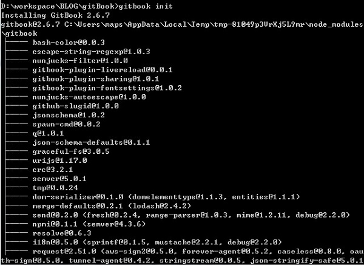
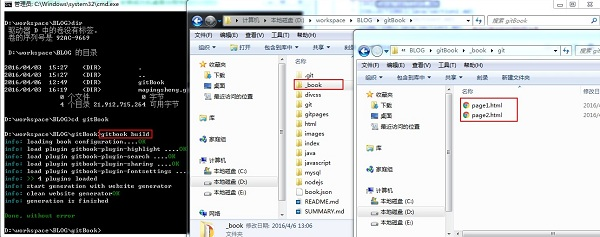

1. 前两篇文章中介绍了使用github Pages功能生成静态博客系统，并且也选择了系统提供的几个博客模板，但是提供的博客模板固然不错，但是总觉得如果有目录导航整个文章目录更便于阅读，就如书本似的(左侧目录+右侧内容文章);
	>csdn上面的博客查看方式
	>
	
采用gitBook构建的博客
	

	
比如上面两个博客图片比对可以感受一下(csdn上面博客和采用gitBook构建的博客)
	

2. gitBook是什么
	
GitBook是一个基于 Node.js 的命令行工具，可使用 Github/Git 和 Markdown 来制作精美的电子书，GitBook 并非关于 Git 的教程。
	GitBook支持输出多种文档格式：
	·静态站点：GitBook默认输出该种格式，生成的静态站点可直接托管搭载Github Pages服务上；
	·PDF：需要安装gitbook-pdf依赖；
	·eBook：需要安装ebook-convert；
	·单HTML网页：支持将内容输出为单页的HTML，不过一般用在将电子书格式转换为PDF或eBook的中间过程；
	·JSON：一般用于电子书的调试或元数据提取。
	使用GitBook制作电子书，必备两个文件：README.md和SUMMARY.md
	
官网:https://www.gitbook.com
	

3. 如何使用gitBook书写文章，需要安装node.js、gitBook、markdown，下面介绍：
	>1)、下载、安装node.js;官网：http://nodejs.cn/
	>
	>
	>
	>下载完成后，直接双击、下一步下一步的进行傻瓜式安装即可！
	>
	>2)、通过window命令安装gitbook服务；
	><code>npm install gitbook -g
	>
	>
	>
	>3)、通过window命令安装gitbook命令服务（gitbook-cli）；
	><code>npm install gitbook-cli -g
	>
	>4)、下载安装markdown；
	>下载地址：http://markdownpad.com/download.html；
	>下载完成后直接下一步下一步安装，安装成功后桌面出现快捷启动图标
	>
	>
	>
	>5)、使用gitbook开始制作电子书式的博客系统；首先在你的硬盘上面新建你个存放你博客的目录，比如BLOG;然后通过window环境下面的cmd命令窗口切换到该目录下面，通过gitbook init命令初始化gitbook服务的目录结构：
	>
	>
	>
	>6)、首先介绍一下gitbook init命令的作用，首先读取SUMMARY.md文件中的目录定义结构，然后会按照该目录结构在对应博客文件夹下面生成对应的文件目录结构,
	>SUMMARY.md文件内容如图
	

	>运行gitbook init命令后生成的目录结构如图
	>
	

	>
	>7)、然后通过gitbook build命令将目录结构中的.md文件(markdown语法格式的文件)转换生成.html文件(静态网页文件)，可以用浏览器浏览查看;
	>
	>
	>
	>8)、截止到这一步我们通过gitbook构建电子书式的博客文章已经完成了，我们只需要把第7)步骤中通过gitbook build命令生成的_book文件夹下面的文件通过git提交到自己github账户下面的博客项目目录下面即可(如果之前自己账户下面的github博客没有用gitbook服务生成的目录构建博客目录的话，可以删除根目录下面旧的目录文件；如果之前已经用过gitbook服务生成的静态目录结构构建过博客目录，那么我们只需要通过git push覆盖旧文件即可)；
	>9)、上面没有讲到如何用markdown工具，其实在第6)步骤中通过gitbook init命令生成的以.md文件组成的目录结构就是markdown的文件，我们需要用markdown工具进行编辑操作，当然.md文件也可以用其他编辑器工具编写，只是个人感觉用markdown工具更方便一些，至于如何用markdown工具编写网页，需要你去先了解一下markdown的语法；这里就不过多介绍了，因为语法内容挺多的！
3. 总结
	>安装node.js、gitbook、markdown
	>
	>通过gitbook init命令初始化目录结构
	>
	>通过markdown工具编辑目录结构文章对应的.md文件
	>
	>通过gitbook build命令将.md文件转换生成.html静态网页文件(默认自动存放在_book文件夹下)
	>
	>通过git push命令将_book文件夹下面生成的.html静态文件推送到自己github账户下面的博客系统项目工程目录下面