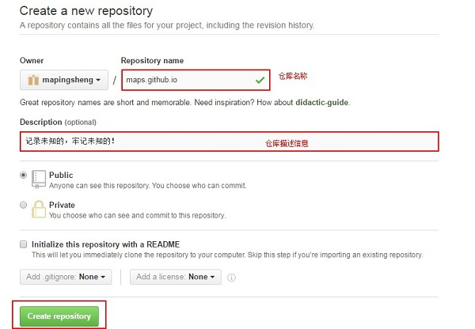
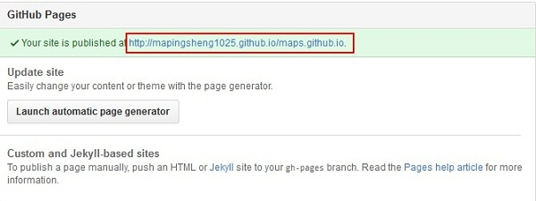
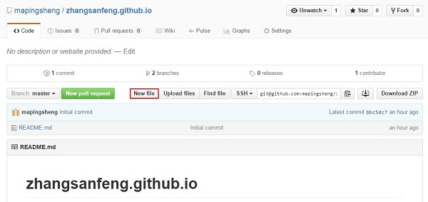
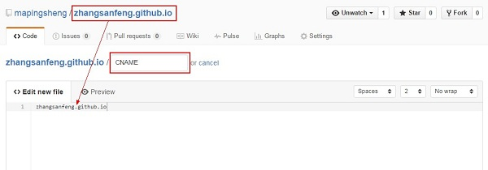

**1 什么是github pages**
>GitHub Pages本用于介绍托管在GitHub的项目， 不过，由于他的空间免费稳定，用来做搭建一个博客再好不过了。
github Pages可以被认为是用户编写的、托管在github上的静态网页。所以说你有以下屌丝要求的话可以考虑使用github Pages提供的服务：免费、稳定、完全自由可控，独立域名访问等等

**2 新建仓库**
>

**3 输入仓库信息**
>

**4 添加成功后，点击“settings”按钮**
>

**5 使用Github Pages生成页面**
>

**6 点击选择博客布局按钮进入选择布局界面**
> 

**7 切换布局选择操作,最后点击“publish page”按钮**
>

**8 发布完成后的界面如下，但是此时我们还不可以使用红框中的二级域名单独访问**
>

**9 然后回到第5步(或者点击settings页签)，每当你点击“Launch automatic page generator”按钮后，可以看到如下所示**
>

点击上图中红框中的访问url地址访问博客

**10 如果我们还没有自己的独立域名，也暂时使用第8步中红框中的二级域名单独访问，而不用访问第9步中那一串长长的且不好记的url地址**
>1)、在项目工程跟目录中添加一个名称为CNAME(无后缀名)的文件,在线或者通过git命令都行
>
>
>2)、将新建项目时输入的二级域名格式的仓库地址添加到文件内容中，文件名称必须为CNAME
>
>
>